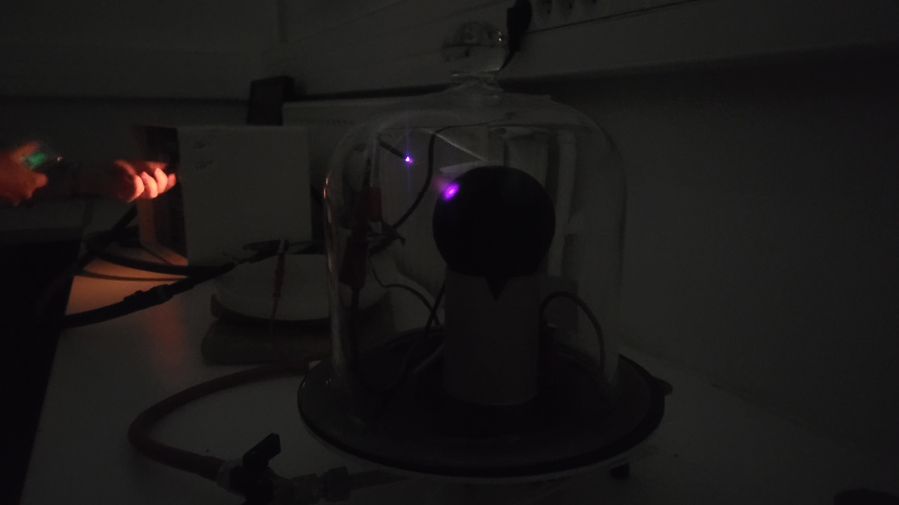

# Aurores polaires

**D'un ion éjecté de la couronne solaire aux lueurs des aurores polaires : des mécanismes physiques et énergétiques au coeur de la magnétosphère…**

> Il s'agit de comprendre et détailler les interactions entre le vent solaire et la magnétosphère terrestre ainsi que leurs origines, afin d'en étudier les conséquences sur Terre et les conditions dans lesquelles elles surviennent, notamment la formation d’aurores polaires et les perturbations géomagnétiques sur nos technologies.

La démarche proposée a pour but d’expliquer chronologiquement la formation d’aurores polaires sur Terre, allant de l’émission des particules de vent solaire jusqu’à leurs interactions dans la magnétosphère terrestre.

Il sera en outre question de confronter la modélisation théorique réalisée ainsi que ses hypothèses avec les résultats expérimentaux et statistiques obtenus. L’idée sera d’étudier la trajectoire des particules solaires en particulier sous l’influence du champ magnétique terrestre et de voir où et comment elles se désexcitent pour former des aurores.

Enfin, la corrélation entre les pics d’activité solaire, l’observation d’aurores et les perturbations géomagnétiques sera mise en exergue.

---

Vous trouverez ici les documents importants relatifs à ce projet tels que l'analyse des données de différents laboratoires ainsi que de notre expérience en Python ainsi que les détails du protocole de l'expérience – simulateur auroral Terrella – et le fichier de présentation du projet.

